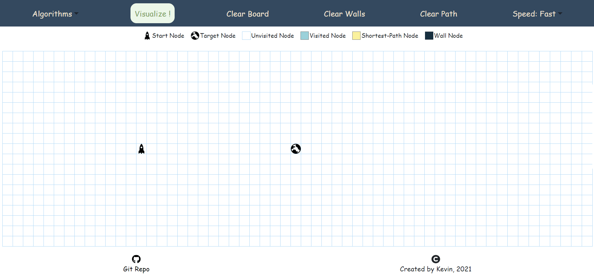

# Pathfinding Visualizer

An interactive web application that helps users visualize search algorithms in a grid environment.



## [Click here to try out the current live version](https://pathfinding-visualizer-kevin.netlify.app)

<!-- TABLE OF CONTENTS -->

## :ledger: Index

<details open="open">
  <summary>Table of Contents</summary>
  <ol>
    <li>
      <a href="#beginner-motivation">Motivation</a>
    </li>
    <li>
     <a href="#hammer-built-with">Built With</a>
    </li>
       <li>
     <a href="#book-algorithms">Algorithms</a>
    </li>
    <li>
      <a href="#zap-getting-started">Getting Started</a>
      <ul>
        <li><a href="#electric_plug-installation">Installation</a></li>
      </ul>
    </li>
    <li><a href="#fire-contributing">Contributing</a></li>
    <li><a href="#cactus-to-do-in-the-future">To-do in the future</a></li>
  </ol>
</details>

## :beginner: Motivation

Being new to frontend web development, this project is an outlet for me to apply the web development knowledge.

Furthermore, I have a personal interest in learning and understanding how different algorithms work, building a pathfinding visualizer helps to reinforce my understanding of them.

To provide a platform that

- runs and visualize search algorithms,
- highlights the differences between the search algorithms, and
- make learning about search algorithms more engaging through interactive elements.

## :hammer: Built With

- React JS
- React Hooks

## :book: Algorithms

**Dijkstra's Algorithm** (weighted): the father of pathfinding algorithms; guarantees the shortest path

<!-- GETTING STARTED -->

## :zap: Getting Started

### :electric_plug: Installation

```bash
git clone https://github.com/dkevin96/pathfinding-visualizer.git
cd pathfinding-visualizer
yarn install
yarn start
```

<!-- CONTRIBUTING -->

## :fire: Contributing

Contributions are what make the open source community such an amazing place to be learn, inspire, and create. Any contributions you make are **greatly appreciated**.

1. Fork the Project
2. Create your Feature Branch (`git checkout -b feature/AmazingFeature`)
3. Commit your Changes (`git commit -m 'Add some AmazingFeature'`)
4. Push to the Branch (`git push origin feature/AmazingFeature`)
5. Open a Pull Request

## :cactus: To-do in the future

I have these ideas in mind that either further expand the existing features or are new features themselves.

### Add More Search Algorithms

Possible additions are:

- Breath-first Search (unweighted): a great algorithm; guarantees the shortest path
- Depth-first Search (unweighted): a very bad algorithm for pathfinding; does not guarantee the shortest path
- Add more heurtistics for informed search algorithms and allow users to switch between them.

### Add Weighted Nodes

Currently it costs 1 step to travel from a node to any of its neighbours. Adding Weighted nodes that cost more to travel through would highlight how different algorithms behave if travel costs are not uniform. (E.g. BFS would not guarantee the optimal path if travel costs are not uniform)
